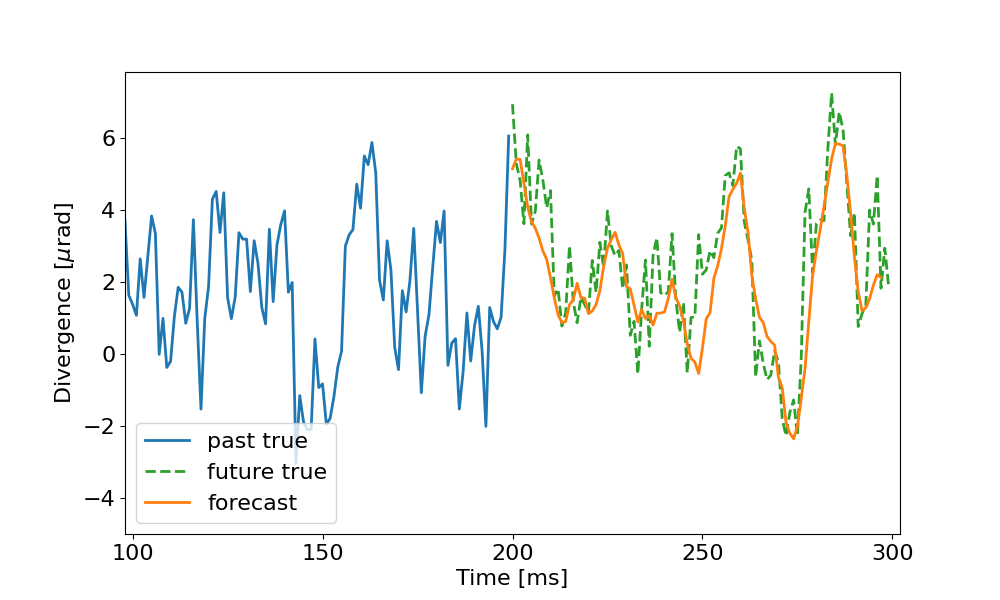

# Predict spatial laser jitter with NNs

The package provides with a number of helper classes for time-series data pre-processing and model training/inference. Currently supported data classes and models:
1. Temporal
2. STFT

## Temporal models
Given time-series (past time steps), predict a certain amount of future time steps. Preprocessing includes smoothing and scaling.

## STFT models

## Installation

