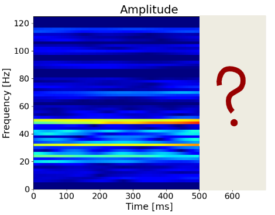

# Predict spatial laser jitter with NNs

The package provides with a number of helper classes for time-series data pre-processing and model training/inference. Currently supported data classes and models (find details in [usage notebook](usage.ipynb)):
1. Temporal
2. STFT

## Temporal models
Given time-series (past time steps), predict a certain amount of future time steps. Preprocessing includes smoothing (optional) and scaling.


## STFT models
Transform given time-series with Short Time Fourier Transform to spectrogram, filter non-dominant frequencies and scale them. Use NNs to predict future variation of real/imag part of each frequency band. Possible options: 1) one model to predict real/imag part for all frequency bands, 2) one model to predict real part for all frequency bands, another to predict imaginary part, 3) separate model for each frequency band.



## Installation
Clone the repository
```bash
git clone https://github.com/maxbalrog/laser-jitter.git
```

Create micromamba environment and activate it, e.g.,
```bash
micromamba create -n laser-jitter python=3.12
micromamba activate laser-jitter
```

Install the package in editable mode (specify path to the cloned repo)
```bash
pip install -e laser-jitter
```

Alternatively, install laser-jitter package from github repository (but the package would be unmodifiable)
```bash
pip install git+https://github.com/maxbalrog/laser-jitter.git
```

(Optional)

Run tests to check everything runs as expected
```bash
python -m pytest laser-jitter/tests/
```

## TODO
- Add attention architecture
- Add hyperparameter optimization module

## Acknowledgements
Paper: in progress...


